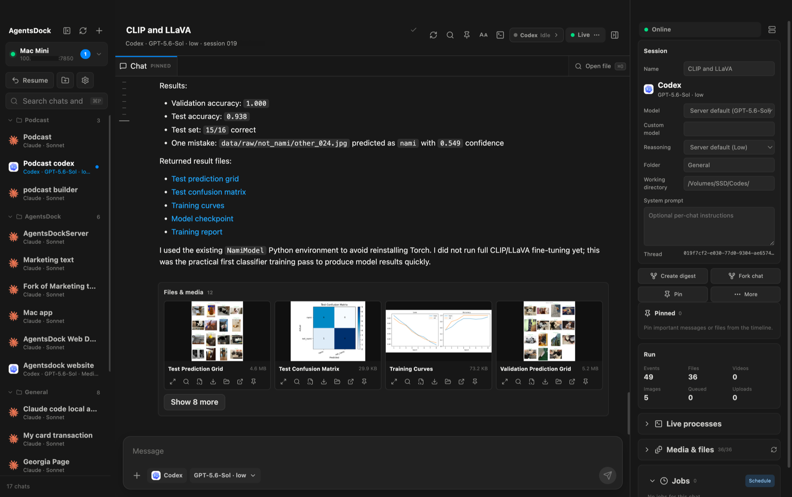

# AgentsDock (website mirror)

A corporate-accessible static mirror of the AgentsDock product site, for viewing when the primary domain isn't reachable from a restricted network.

- **Live site:** https://agentsdock.net
- **Source:** this mirror is a snapshot of the `website/` directory from [ZhengyiLuo/AgentsDock](https://github.com/ZhengyiLuo/AgentsDock) (`website-georgia` branch) — make changes there, not in this repo.



AgentsDock connects to an AgentsServer that you run and control, so you can chat with Codex or Claude from your desktop or phone, from anywhere.

## Preview locally

```bash
npx serve .
```

This is a snapshot of static files (HTML/CSS/JS) — no build step required.
